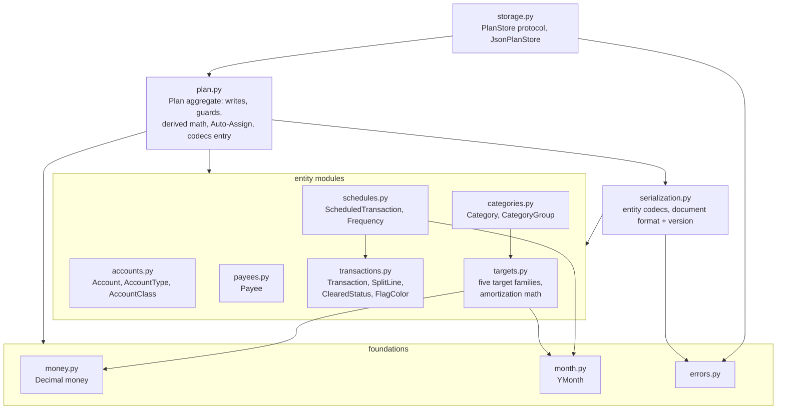
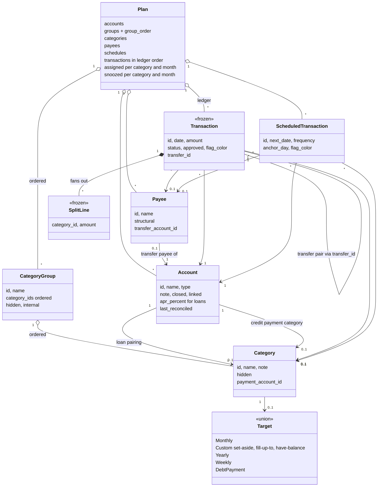
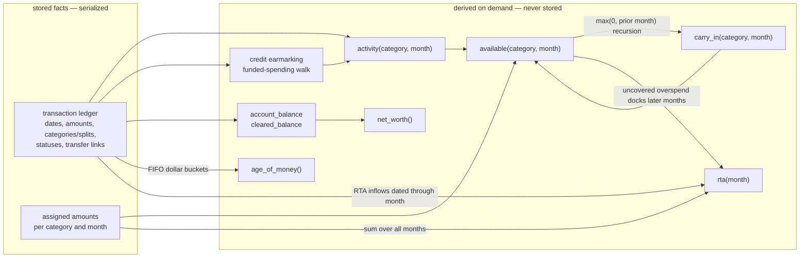
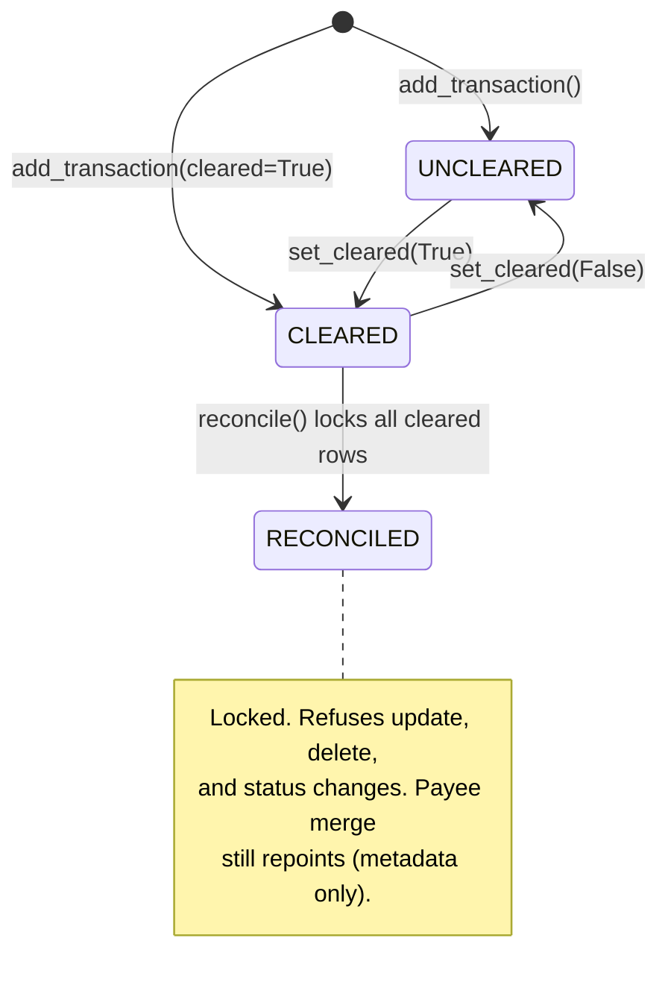
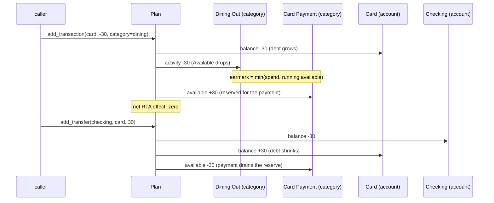

# Architecture

Diagrams of the ledger engine. All are Mermaid, rendered natively by GitHub
and by IDEs with Mermaid support. [DESIGN.md](DESIGN.md) holds the behavioral
specification these structures implement; [api.yaml](api.yaml) is the API
surface the engine is meant to back.

## Module dependencies

Foundations at the bottom, the `Plan` aggregate in the middle, persistence on
top. Arrows point at what a module imports.

## Domain model

The `Plan` owns every entity; identity is by string id. Frozen types are the
event-sourced facts, plain dataclasses are mutable aggregates.

## Stored facts vs. derived figures

The engine's central design decision: transactions and assigned amounts are
the only stored money facts. Everything a budget screen would show is
recomputed from them on demand, so month rollover is a query, not a
close-out step, and persistence is trivially lossless.

## Cleared-status lifecycle

Reconciliation is a trust boundary: it freezes history, and locked rows
refuse edits, deletion, and status changes.

## Credit-card mechanics

Spending on a card moves budgeted dollars into the card's payment category;
paying the bill drains them. Ready to Assign never moves.

